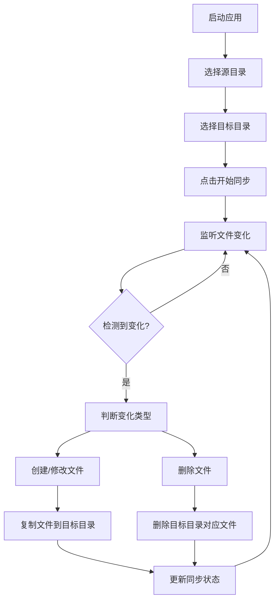

## 1. 产品概述
FileSynchronizer是一款跨平台（Mac & Windows）文件同步应用，帮助用户实现源目录到目标目录的实时文件同步。用户可以轻松选择需要监控的源目录和目标同步目录，应用会自动监听文件变化并即时同步，确保两个目录内容保持一致。

该应用主要解决用户在多设备间或备份场景下的文件同步需求，适用于设计师、开发者、办公人员等需要频繁文件同步的用户群体，提供简单可靠的文件同步解决方案。

## 2. 核心功能

### 2.1 用户角色
本应用为单用户应用，无需区分不同用户角色。

### 2.2 功能模块
FileSynchronizer应用包含以下核心页面：
1. **主界面**：目录选择、同步状态显示、同步控制按钮。
2. **设置页面**：应用偏好设置、同步规则配置。

### 2.3 页面详情

| 页面名称 | 模块名称 | 功能描述 |
|---------|---------|---------|
| 主界面 | 目录选择区域 | 选择源目录和目标目录，显示当前选择的目录路径，提供浏览按钮打开文件选择器。 |
| 主界面 | 同步状态显示 | 实时显示同步状态（空闲、同步中、错误），显示最近同步的文件名和时间，显示同步统计信息（总文件数、已同步文件数）。 |
| 主界面 | 同步控制 | 开始/暂停同步按钮，重置同步状态按钮，查看同步日志按钮。 |
| 主界面 | 文件变化监控 | 实时显示检测到的文件变化列表，包括文件名、变化类型（创建、修改、删除）、处理状态。 |
| 设置页面 | 同步规则 | 设置文件过滤规则（包含/排除特定文件类型），设置同步延迟时间，设置是否删除目标目录文件。 |
| 设置页面 | 应用设置 | 设置开机自启动，设置最小化到系统托盘，设置同步完成通知，选择界面主题（浅色/深色）。 |
| 设置页面 | 关于信息 | 显示应用版本、开发者信息、检查更新按钮。 |

## 3. 核心流程

### 主流程：文件同步
1. 用户启动应用，进入主界面。
2. 用户点击"选择源目录"按钮，通过文件选择器选择需要监控的目录。
3. 用户点击"选择目标目录"按钮，选择同步目标目录。
4. 用户点击"开始同步"按钮，应用开始监听源目录。
5. 当检测到文件创建或修改时，应用立即将文件复制到目标目录（同名文件直接覆盖）。
6. 当检测到文件删除时，应用同步删除目标目录中的对应文件。
7. 同步过程中实时更新状态显示和统计信息。
8. 用户可随时暂停或停止同步。

## 4. 用户界面设计

### 4.1 设计风格
- **设计类型**：扁平化设计（Flat Design）
- **主色调**：#0D9488（青绿色）
- **辅助色**：#F0FDFA（浅青色背景）、#14B8A6（ hover状态）、#0F766E（激活状态）
- **字体**：Plus Jakarta Sans，主要字号14-16px，标题字号18-24px
- **按钮样式**：圆角矩形，圆角半径8px，扁平化无阴影
- **布局风格**：卡片式布局，左侧功能区域，右侧状态显示区域
- **图标风格**：简约线性图标，使用SVG格式

### 4.2 页面设计概述

| 页面名称 | 模块名称 | UI元素 |
|---------|---------|---------|
| 主界面 | 目录选择区域 | 两个并排的文件选择卡片，每个卡片包含文件夹图标、路径显示文本框、浏览按钮，卡片背景色为白色，边框为#E5E7EB，圆角12px。 |
| 主界面 | 同步状态显示 | 顶部状态指示器使用彩色圆点（绿色-同步中、灰色-空闲、红色-错误），状态文字使用16px粗体，统计信息使用14px常规字体显示在卡片中。 |
| 主界面 | 同步控制按钮 | 大型操作按钮（120px宽，44px高），主按钮使用#0D9488背景色，白色文字，按钮hover时背景色变为#14B8A6，按钮文字使用16px粗体。 |
| 主界面 | 文件变化列表 | 可滚动的列表区域，每行显示文件图标、文件名、变化类型标签（创建-绿色、修改-蓝色、删除-红色）、时间戳，列表项高度48px。 |
| 设置页面 | 设置选项卡 | 左侧导航栏使用标签页设计，激活标签背景色为#0D9488，文字为白色，未激活标签为白色背景，灰色文字，标签高度40px。 |
| 设置页面 | 设置项卡片 | 每个设置项使用独立卡片，包含设置标题、描述文字、开关或输入控件，卡片间距16px，内边距20px。 |

### 4.3 响应式设计
- **桌面优先**：主要面向桌面端用户，界面针对1024x768及以上分辨率优化
- **窗口大小适配**：应用窗口可调整大小，最小尺寸800x600px
- **系统托盘集成**：支持最小化到系统托盘，右键菜单提供快速操作

### 4.4 应用图标设计
- **图标形状**：简约的几何形状，两个交错重叠的文件夹图标
- **颜色方案**：主色#0D9488，搭配白色和浅灰色
- **尺寸规格**：提供16x16、32x32、48x48、128x128、256x256、512x512多种尺寸
- **格式要求**：PNG格式，支持透明背景，适配Mac和Windows系统