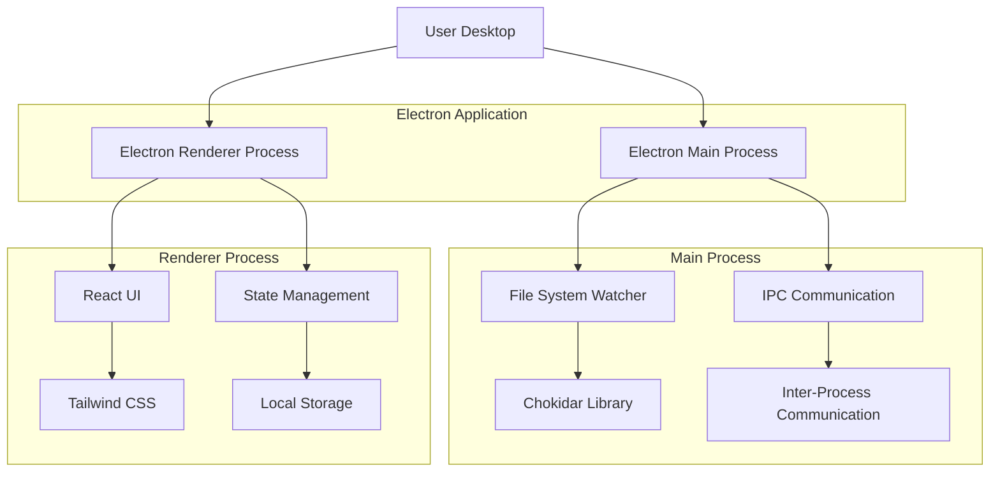
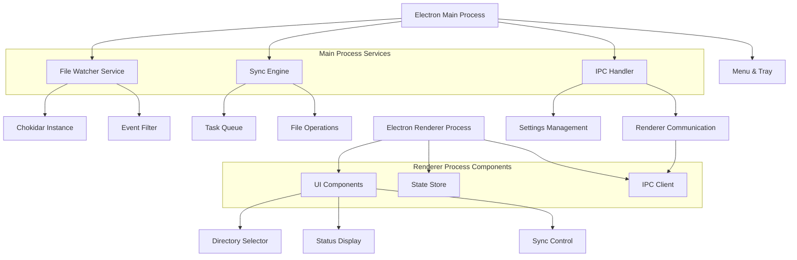
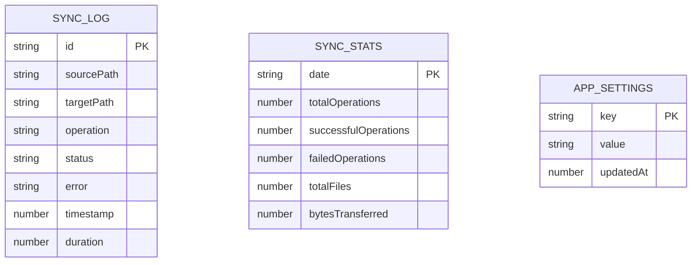

## 1. 架构设计



## 2. 技术描述

- **前端框架**：React@18 + Tailwind CSS@3 + Vite
- **初始化工具**：vite-init
- **桌面应用框架**：Electron@27
- **文件监控**：Chokidar@3（Node.js文件系统监视库）
- **进程通信**：Electron IPC（主进程与渲染进程通信）
- **状态管理**：React Context API + useReducer
- **本地存储**：Electron Store（用户偏好设置持久化）
- **打包工具**：Electron Builder（支持Mac和Windows双平台）

## 3. 路由定义

| 路由 | 用途 |
|-------|---------|
| / | 主界面，显示文件同步控制面板和状态信息 |
| /settings | 设置页面，配置同步规则和应用偏好 |
| /about | 关于页面，显示应用信息和版本 |

## 4. 核心模块定义

### 4.1 文件同步相关

**文件变化事件类型**
```typescript
interface FileChangeEvent {
  type: 'add' | 'change' | 'unlink' | 'addDir' | 'unlinkDir'
  path: string
  stats?: fs.Stats
  timestamp: number
}
```

**同步任务接口**
```typescript
interface SyncTask {
  id: string
  sourcePath: string
  targetPath: string
  operation: 'copy' | 'delete'
  status: 'pending' | 'processing' | 'completed' | 'failed'
  error?: string
  createdAt: number
  completedAt?: number
}
```

**同步状态接口**
```typescript
interface SyncStatus {
  isWatching: boolean
  isSyncing: boolean
  lastSyncTime?: number
  totalFiles: number
  syncedFiles: number
  failedFiles: number
  currentTask?: string
  error?: string
}
```

### 4.2 应用配置相关

**用户设置接口**
```typescript
interface UserSettings {
  sourceDirectory: string
  targetDirectory: string
  autoStart: boolean
  minimizeToTray: boolean
  showNotifications: boolean
  syncDelay: number // 毫秒
  fileFilters: {
    include: string[] // 包含的文件类型，如 ['.txt', '.doc']
    exclude: string[] // 排除的文件类型，如 ['.tmp', '.log']
  }
  deleteOnSync: boolean // 源文件删除时是否删除目标文件
  theme: 'light' | 'dark'
}
```

## 5. 进程架构设计



## 6. 数据模型

### 6.1 同步日志数据模型



### 6.2 数据定义语言

**同步日志表**
```sql
-- 同步日志存储（使用SQLite本地数据库）
CREATE TABLE sync_logs (
  id TEXT PRIMARY KEY,
  source_path TEXT NOT NULL,
  target_path TEXT NOT NULL,
  operation TEXT CHECK(operation IN ('copy', 'delete')),
  status TEXT CHECK(status IN ('pending', 'processing', 'completed', 'failed')),
  error TEXT,
  timestamp INTEGER NOT NULL,
  duration INTEGER,
  file_size INTEGER
);

-- 创建索引
CREATE INDEX idx_sync_logs_timestamp ON sync_logs(timestamp DESC);
CREATE INDEX idx_sync_logs_status ON sync_logs(status);
CREATE INDEX idx_sync_logs_operation ON sync_logs(operation);
```

**应用设置表**
```sql
-- 应用设置存储
CREATE TABLE app_settings (
  key TEXT PRIMARY KEY,
  value TEXT NOT NULL,
  updated_at INTEGER NOT NULL
);

-- 初始化默认设置
INSERT INTO app_settings (key, value, updated_at) VALUES 
('sourceDirectory', '', strftime('%s', 'now')),
('targetDirectory', '', strftime('%s', 'now')),
('autoStart', 'false', strftime('%s', 'now')),
('minimizeToTray', 'true', strftime('%s', 'now')),
('showNotifications', 'true', strftime('%s', 'now')),
('syncDelay', '100', strftime('%s', 'now')),
('deleteOnSync', 'true', strftime('%s', 'now')),
('theme', 'light', strftime('%s', 'now'));
```

## 7. 关键技术实现

### 7.1 文件监控实现
使用Chokidar库实现跨平台的文件系统监控：
```javascript
// 主进程文件监控服务
const chokidar = require('chokidar')

class FileWatcherService {
  constructor() {
    this.watcher = null
    this.isWatching = false
  }
  
  startWatching(sourcePath, options) {
    this.watcher = chokidar.watch(sourcePath, {
      ignored: options.exclude,
      persistent: true,
      ignoreInitial: true,
      followSymlinks: false,
      depth: options.maxDepth || 99
    })
    
    this.watcher.on('add', (path) => this.handleFileAdd(path))
    this.watcher.on('change', (path) => this.handleFileChange(path))
    this.watcher.on('unlink', (path) => this.handleFileDelete(path))
    
    this.isWatching = true
  }
}
```

### 7.2 IPC通信实现
主进程与渲染进程间的通信：
```javascript
// IPC通道定义
const IPC_CHANNELS = {
  SELECT_DIRECTORY: 'select-directory',
  START_SYNC: 'start-sync',
  STOP_SYNC: 'stop-sync',
  SYNC_STATUS: 'sync-status',
  FILE_CHANGE: 'file-change',
  GET_SETTINGS: 'get-settings',
  SAVE_SETTINGS: 'save-settings'
}

// 主进程IPC处理器
ipcMain.handle(IPC_CHANNELS.SELECT_DIRECTORY, async () => {
  const result = await dialog.showOpenDialog(mainWindow, {
    properties: ['openDirectory']
  })
  return result.filePaths[0]
})
```

### 7.3 文件同步算法
智能文件同步策略：
1. **变化检测**：实时监控文件系统事件
2. **冲突处理**：同名文件直接覆盖，删除操作同步执行
3. **错误恢复**：失败任务自动重试，最多3次
4. **性能优化**：批量处理相似操作，避免频繁IO